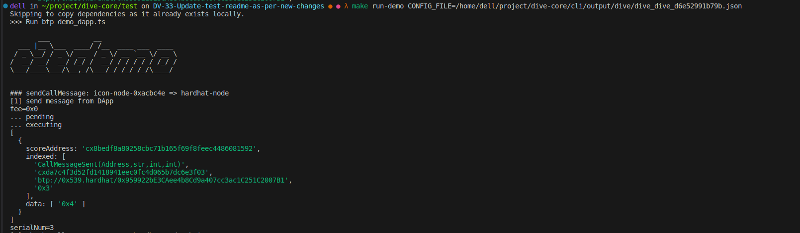
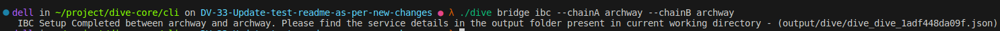
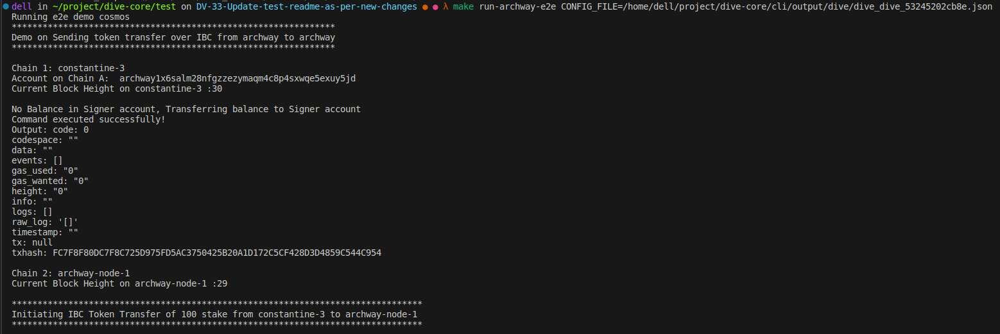
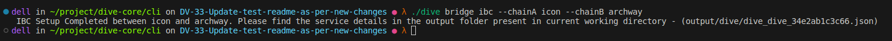
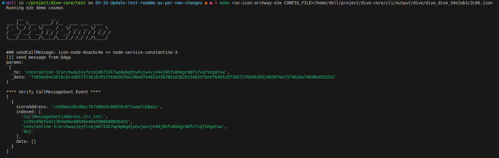

# End-to-End Testing Demo

This is a demo script from btp2 that demonstrates simple e2e testing scenarios.

## Prerequisites

To run the demo, the following software needs to be installed.

- Node.js 18 (LTS) \[[download](https://nodejs.org/en/download/)\]
- Docker compose (V2) \[[download](https://docs.docker.com/compose/install/)\]
- OpenJDK 11 or above \[[download](https://adoptium.net/)\]
- jq \[[download](https://github.com/stedolan/jq)\]
- go \[[download](https://go.dev/doc/install)\]

## Steps to run the script

- Step 1: Run the DIVE command that spins ups two chains for sending message using BTP. Once the setup is complete, details in services json file will be created and you can find the path and filename in the output of dive command.

  Example - `dive bridge btp --chainA icon --chainB eth`

- Step 2: Once the setup is completed note down the path to services json file. Test scripts can be found in test folder from root directory. cd to test folder and install the dependencies using 

  `npm install`

**NOTE:** If the transfer is from icon to icon then you can proceed to next step else before moving to next step the only change we need to manually update is the localnet network url in hardhatconfig.ts file to eth/hardhat endpoint_public from services json file. 

- Step 3: now run the command `make run-demo CONFIG_FILE=path to services.json file` to execute all scenarios.

  

> **Note:**
> Running the demo script will copy all the dependencies required from the container. We can clean the dependencies by running `make clean-dep` command.

# End-to-End archway - archway Demo

## Steps to run the demo

- Step 1: Run the dive command that spins ups two archway chain for sending message using IBC. Wait for the setup to be completed

  

- Step 2: Once the setup is completed note down the path to services json file. Test scripts can be found in test folder from root directory. cd to test folder and install the dependencies using 

  `npm install`

- Step 3: Now just  run the command given below to execute e2e demo which transfers token from one archway chain to another 

  `make run-archway-e2e CONFIG_FILE=path to services.json file`

  

> **Note:**
> To run neutron-neutron demo, follow the steps same as above but to run neutron nodes and then run the command `make run-neutron-e2e CONFIG_FILE=path to services.json file`

# End-to-End icon - archway Demo

- Step 1: Run the dive command that spins ups icon and archway chain and creates an ibc bridge for cross communication.
  

- Step 2: Once the setup is completed note down the path to services json file. Test scripts can be found in test folder from root directory. cd to test folder and install the dependencies using 

  `npm install`

- Step 3: Now just the run the command given below to execute e2e demo from Icon to Archway and vice versa.

  `make run-icon-archway-e2e CONFIG_FILE=path to services.json file`

  

> **IMPORTANT** - If the message is not received on destination chain or the demo doesn't proceed to next step, please run the command `rly start` from the ibc-relay shell

> **Note:**
> To run icon-netron demo, follow the steps same as above but to run neutron and icon nodes and then run the command `make run-icon-neutron-e2e CONFIG_FILE=path to services.json file`

