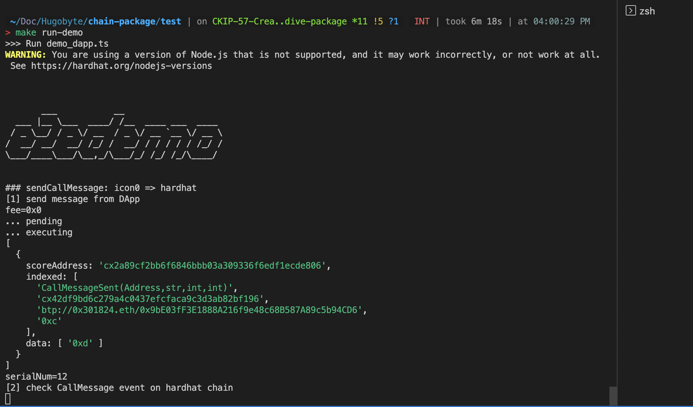
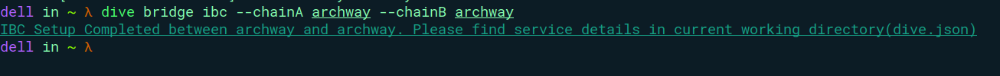
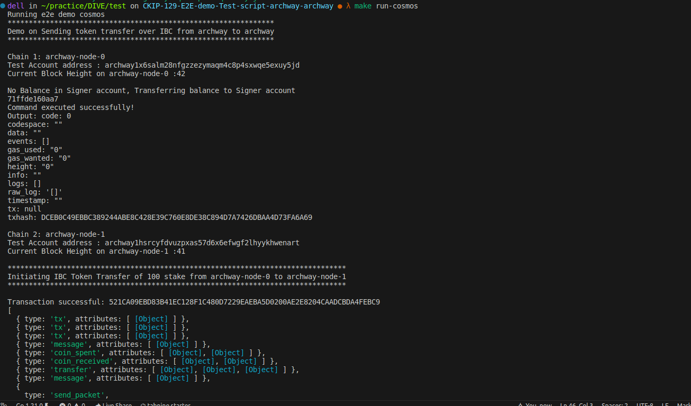
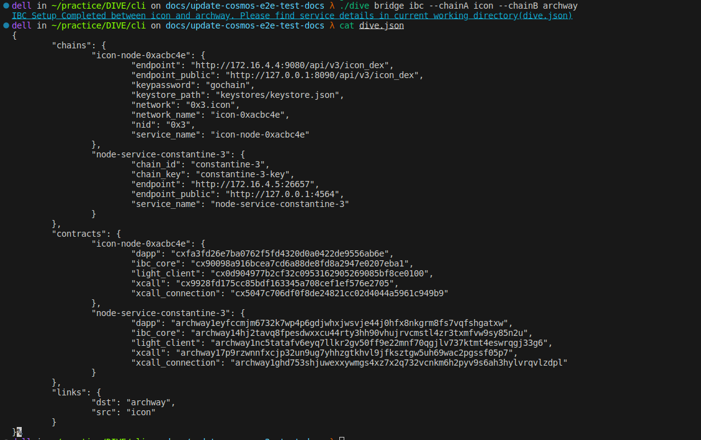
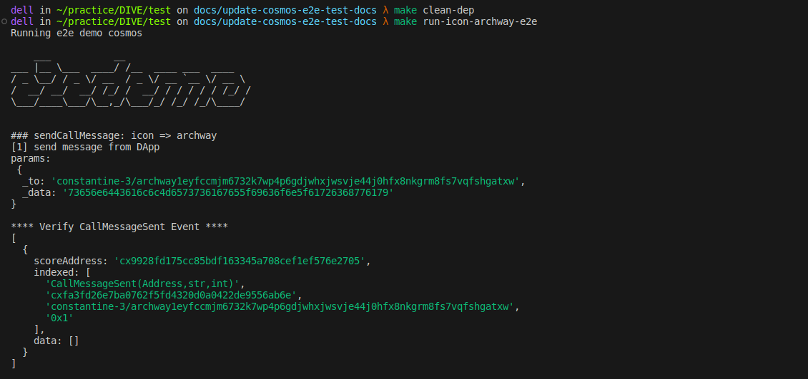
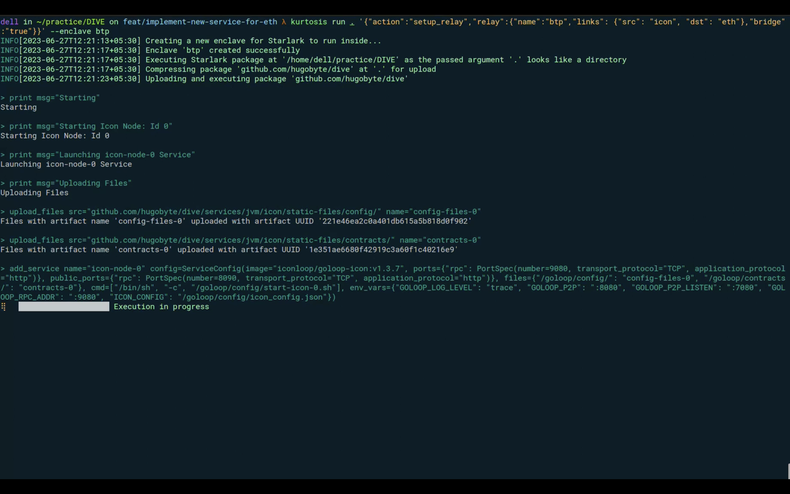
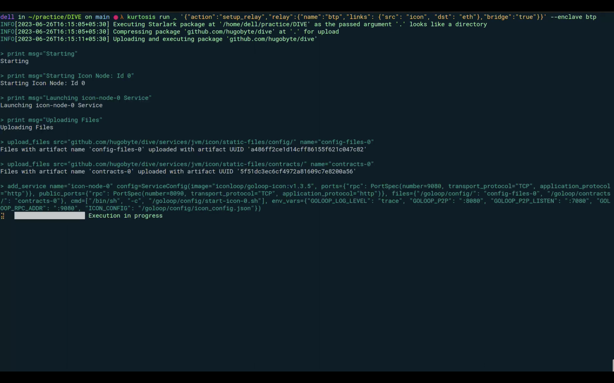

# End-to-End Testing Demo

This is a demo script from btp2 that demonstrates simple e2e testing scenarios.

## Prerequisites

To run the demo, the following software needs to be installed.

- Node.js 18 (LTS) \[[download](https://nodejs.org/en/download/)\]
- Docker compose (V2) \[[download](https://docs.docker.com/compose/install/)\]
- OpenJDK 11 or above \[[download](https://adoptium.net/)\]
- jq \[[download](https://github.com/stedolan/jq)\]
- go \[[download](https://go.dev/doc/install)\]

## Steps to run the script

- Step 1: Run the DIVE command that spins ups two chains for sending message using BTP

  

- Step 2: After you get the contract address from the output, update xCall and dApp address in deployment.json file

  

- Step 3: Update network and endpoint in the chain_config.json, deployments.json and hardhat.config.ts files

  

- Step 4: now run the command `make run-demo` to execute all scenarios.

  

> **Note:**
> Running the demo script will copy all the dependencies required from the container. We can clean the dependencies by running `make clean-dep` command.

# End-to-End archway - archway Demo

## Steps to run the demo

- Step 1: Run the dive command that spins ups two archway chain for sending message using IBC. Wait for the setup to be completed

  

- Step 2: now run the command `make run-archway-e2e` to execute e2e demo which transfers token from one archway chain to another.

  

> **Note:**
> To run neutron-netron demo, follow the steps same as above but to run neutron nodes and then run the command `make run-neutron-e2e`

# End-to-End icon - archway Demo
- Step 1: Run the dive command that spins ups icon and archway chain and creates an ibc bridge for cross communication.
  

- Step 2: Update the `contracts.json` file present in the folder `test/scripts/cosmos` with contract address that can be found in dive.json after the command is run successfully.

- Step 3: Now just the run the command `make run-icon-archway-e2e` from test folder to execute e2e demo from Icon to Archway and vice versa.
  

> **Note:**
> To run icon-netron demo, follow the steps same as above but to run neutron and icon nodes and then run the command `make run-icon-neutron-e2e`

## Video

- D.I.V.E. package setup for testing the bridge between EVM and ICON using BTP2

  

- Setup EVM and JVM local nodes using the D.I.V.E package

  
